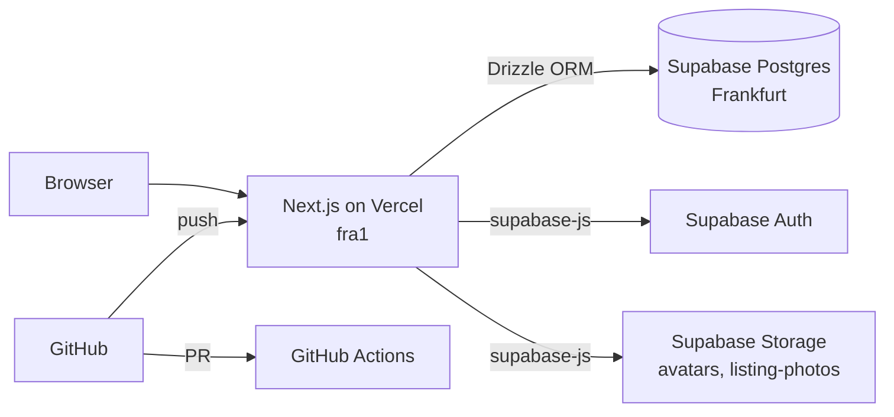
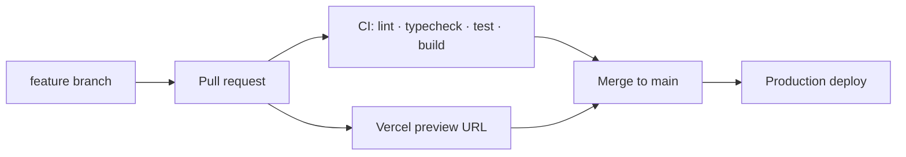

<div align="center">

# 🏠 Kotzoeker

**Find your student room (_kot_) near campus — fast, honest and in one place.**

[](https://github.com/JonasSlenders05/Kotzoeker/actions/workflows/ci.yml)


</div>

---

## About

Kotzoeker is a web app that helps students in Belgium find a _kot_ (student room) and helps landlords (_kotbazen_) fill theirs with minimal effort.

- **Students** search by campus, see travel time by bike, on foot or by public transport, and describe what they want in plain language.
- **Landlords** post a room by uploading photos and a short text — AI completes the listing, they review and publish.
- **Both** chat in-app and plan viewings through bookable time slots.

> 🚧 **Status:** Phase 0 — foundation. The infrastructure (monorepo, database, CI/CD, deployment) is in place; features are being built next.

## Features

| Feature                                                                   | Status     |
| ------------------------------------------------------------------------- | ---------- |
| Monorepo, CI pipeline, preview deployments                                | ✅ Done    |
| Database schema v1 (profiles, listings, amenities, chat, viewings)        | ✅ Done    |
| Authentication (student / landlord roles)                                 | 🔜 Planned |
| Post a listing: photo upload + AI-completed description                   | 🔜 Planned |
| Campus search with list + map view                                        | 🔜 Planned |
| Matching via short preference questionnaire                               | 🔜 Planned |
| In-app chat (realtime)                                                    | 🔜 Planned |
| Viewing slots & booking                                                   | 🔜 Planned |
| Routes to campus (bike / walk / public transport) + nearby shops, gyms, … | 🔜 Planned |
| Semantic search ("quiet room with lots of light near Schoonmeersen")      | 🔜 Planned |
| Rental contracts: draft, send and e-sign in the app                       | 💡 Later   |

## Tech stack

| Layer               | Choice                                                                                    |
| ------------------- | ----------------------------------------------------------------------------------------- |
| Language            | TypeScript (strict) everywhere                                                            |
| Frontend + API      | [Next.js](https://nextjs.org) (App Router, Route Handlers, Server Actions) + Tailwind CSS |
| Database            | PostgreSQL on [Supabase](https://supabase.com)                                            |
| ORM & migrations    | [Drizzle ORM](https://orm.drizzle.team) + drizzle-kit                                     |
| Auth & file storage | Supabase Auth + Supabase Storage                                                          |
| Monorepo            | pnpm workspaces + [Turborepo](https://turborepo.com)                                      |
| CI                  | GitHub Actions (lint, typecheck, test, build)                                             |
| Hosting             | [Vercel](https://vercel.com) (region `fra1`, preview per PR)                              |

## Architecture



- **Drizzle** handles all application queries server-side.
- **supabase-js** is used for auth, file uploads and (later) realtime chat.
- **Row Level Security** is enabled on every table as a second line of defence.

## Project structure

```
kotzoeker/
├─ apps/
│  └─ web/                # Next.js app (UI + API)
├─ packages/
│  ├─ db/                 # Drizzle schema, client, migration config
│  └─ config/             # Shared tsconfig / lint presets
├─ supabase/
│  ├─ migrations/         # SQL migrations (generated by drizzle-kit + custom)
│  ├─ seed.sql            # Institutions, campuses, amenities, sample listings
│  └─ config.toml
├─ .github/workflows/     # CI
├─ turbo.json
└─ pnpm-workspace.yaml
```

## Getting started

### Prerequisites

- [Node.js](https://nodejs.org) LTS (22+) — see `.nvmrc`
- [pnpm](https://pnpm.io) via Corepack: `corepack enable`
- [Docker Desktop](https://www.docker.com/products/docker-desktop/) (for the local Supabase stack)

### Setup

```bash
# 1. Clone and install
git clone https://github.com/JonasSlenders05/Kotzoeker.git
cd Kotzoeker
pnpm install

# 2. Start local Supabase (Postgres, Auth, Storage, Studio)
pnpm supabase start

# 3. Configure environment variables
cp .env.example apps/web/.env.local
#    → fill in the URL and keys printed by `supabase start`

# 4. Build the database from migrations + seed data
pnpm supabase db reset

# 5. Run the app
pnpm dev
```

| Service         | URL                              |
| --------------- | -------------------------------- |
| App             | http://localhost:3000            |
| Health check    | http://localhost:3000/api/health |
| Supabase Studio | http://localhost:54323           |

### Environment variables

| Variable                        | Description                                            | Public |
| ------------------------------- | ------------------------------------------------------ | ------ |
| `NEXT_PUBLIC_SUPABASE_URL`      | Supabase project URL                                   | ✅     |
| `NEXT_PUBLIC_SUPABASE_ANON_KEY` | Supabase anon / publishable key                        | ✅     |
| `SUPABASE_SERVICE_ROLE_KEY`     | Service role key — server only, never expose           | ❌     |
| `DATABASE_URL`                  | Postgres connection (transaction pooler in production) | ❌     |
| `DIRECT_URL`                    | Direct / session connection, used for migrations       | ❌     |

## Scripts

Run from the repository root:

| Command                                   | What it does                                  |
| ----------------------------------------- | --------------------------------------------- |
| `pnpm dev`                                | Start all apps in development mode            |
| `pnpm build`                              | Production build                              |
| `pnpm lint`                               | ESLint across the monorepo                    |
| `pnpm typecheck`                          | Generate Next.js route types + `tsc --noEmit` |
| `pnpm test`                               | Run tests                                     |
| `pnpm format`                             | Format with Prettier                          |
| `pnpm --filter @kotzoeker/db db:generate` | Generate a migration from the Drizzle schema  |
| `pnpm --filter @kotzoeker/db db:studio`   | Open Drizzle Studio                           |
| `pnpm supabase db reset`                  | Rebuild the local DB from migrations + seed   |
| `pnpm supabase db push`                   | Apply migrations to the linked cloud project  |

## Database

Schema v1 lives in [`packages/db/src/schema.ts`](packages/db/src/schema.ts).

| Domain         | Tables                                                     |
| -------------- | ---------------------------------------------------------- |
| Users          | `profiles`, `student_profiles`, `landlord_profiles`        |
| Reference data | `institutions`, `campuses`, `amenities`                    |
| Listings       | `listings`, `listing_photos`, `listing_amenities`          |
| Matching       | `student_preferences`, `preference_amenities`, `favorites` |
| Chat           | `conversations`, `messages`                                |
| Viewings       | `visit_slots`, `visit_bookings`                            |

Design notes:

- Money is stored in **cents** (integers), timestamps as `timestamptz`.
- Amenities (bathroom, sink, toilet, kitchen, furnished, …) are a fixed list; whether one is **private or shared** is stored per listing in `listing_amenities.is_shared`.
- A signup trigger creates the profile and role profile automatically; users can never assign themselves the `admin` role.

### Changing the schema

```bash
# 1. Edit packages/db/src/schema.ts
# 2. Generate the migration
pnpm --filter @kotzoeker/db db:generate
# 3. Apply locally and check
pnpm supabase db reset
# 4. Commit schema + migration together; after merge:
pnpm supabase db push
```

## CI/CD



- Every PR runs CI and gets its own Vercel preview deployment.
- `main` is protected: CI must pass before merging.
- Merging to `main` deploys to production automatically.

## Design

Low-fidelity wireframes of the five core screens — home & search, results (list + map), listing detail, post a listing, and messages & viewings — live in [`docs/wireframes/`](docs/wireframes/).

## Author

**Jonas Slenders** — AI & Data Engineering student at HOGENT, freelance data engineer.

- GitHub: [@JonasSlenders05](https://github.com/JonasSlenders05)

## License

All rights reserved.
